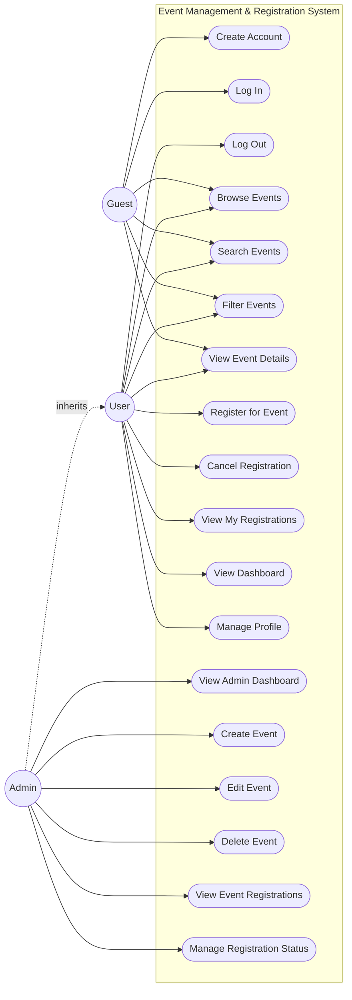

# 3.1 Use Case

## Actors

- **Guest** — an unauthenticated visitor.
- **User** — an authenticated account with role `user`. Inherits everything a Guest can do, plus registration and account management.
- **Admin** — an authenticated account with role `admin`. Inherits everything a User can do, plus event and registration management.

## Use case descriptions

| ID | Use case | Actor | Description |
|---|---|---|---|
| UC1 | Create Account | Guest | Sign up with full name, email, and password. |
| UC2 | Log In | Guest | Authenticate with email and password. |
| UC3 | Log Out | User | End the current session. |
| UC4 | Browse Events | Guest, User | View the list of all events. |
| UC5 | Search Events | Guest, User | Filter the event list by title text. |
| UC6 | Filter Events | Guest, User | Filter the event list by category and/or status. |
| UC7 | View Event Details | Guest, User | Open a single event's full details. |
| UC8 | Register for Event | User | Create (or reactivate) a registration for an event, subject to capacity/status rules. |
| UC9 | Cancel Registration | User | Change an active registration's status to cancelled. |
| UC10 | View My Registrations | User | See all of one's own registrations, active and cancelled. |
| UC11 | View Dashboard | User | See a summary: upcoming registered events, registration counts, recent activity. |
| UC12 | Manage Profile | User | View and update full name. |
| UC13 | View Admin Dashboard | Admin | See system-wide statistics. |
| UC14 | Create Event | Admin | Add a new event. |
| UC15 | Edit Event | Admin | Modify an existing event's details. |
| UC16 | Delete Event | Admin | Remove an event (with confirmation), cascading to its registrations. |
| UC17 | View Event Registrations | Admin | See everyone registered for a specific event. |
| UC18 | Manage Registration Status | Admin | Cancel or reinstate a specific participant's registration. |

## 3.1.1 Use Case Diagram

## Key interactions

**Registering for an event (UC8)** is the most important interaction in the system:
1. The user opens an event's details page.
2. If not logged in, they are prompted to log in first.
3. If the event is cancelled, completed, or full, registration is blocked with a clear message.
4. Otherwise, the user clicks "Register", and a `registrations` row is created (or an existing cancelled one is reactivated).
5. The database double-checks capacity and event status at write time (not just in the UI) before accepting the registration.

**Admin managing an event (UC14–UC18)** mirrors typical CRUD administration, with the addition that deleting an event cascades to delete its registrations, and registration status changes (UC18) let an admin correct a participant's status without deleting history.
