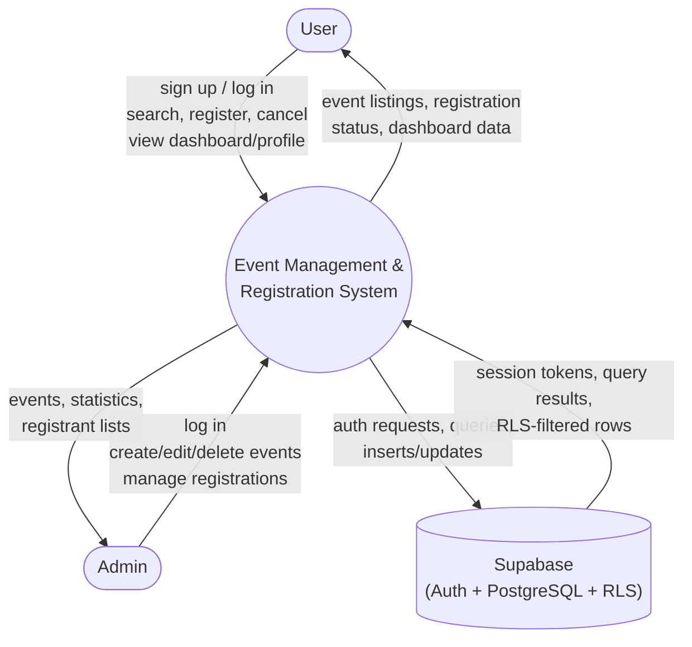

# 3.2 Context Diagram

The Context Diagram (DFD Level 0) shows the system as a single process, and the external entities that interact with it. Note that "Supabase" is drawn as an external system because the React frontend is a client of it (authentication, database, and enforcement of access rules all happen there) — there is no custom backend server in this project.

## Description

- **User** and **Admin** are the two human external entities. They interact only through the React application in the browser.
- **Supabase** is the single external system: it provides authentication (issuing/validating session tokens), the PostgreSQL database (storing events, registrations, and profiles), and Row Level Security (deciding, per request, which rows a given authenticated user is allowed to read or write).
- The **Event Management & Registration System** process represents the whole React single-page application — there is intentionally no separate custom backend process, since Supabase's auto-generated API plus RLS plays that role.
