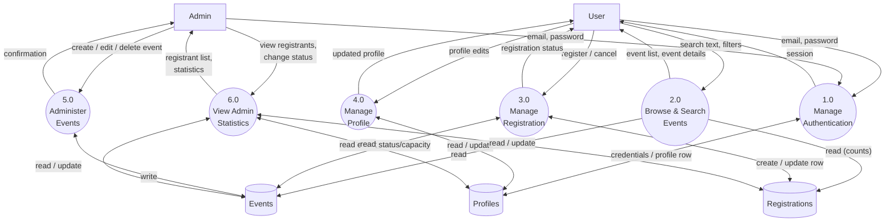

# 3.2.1 DFD Level 1

DFD Level 1 expands the single system process from the Context Diagram into its major functional processes, and introduces the data stores they read from and write to.

## Process descriptions

| Process | Description | Reads | Writes |
|---|---|---|---|
| 1.0 Manage Authentication | Sign up, log in, log out, session restore | Profiles (to load role) | Profiles (auto-created on sign up via trigger) |
| 2.0 Browse & Search Events | List, search by title, filter by category/status, view details | Events, Registrations (for counts) | — |
| 3.0 Manage Registration | Register for an event, cancel a registration | Events (status/capacity), Registrations | Registrations |
| 4.0 Manage Profile | View/update full name | Profiles | Profiles |
| 5.0 Administer Events | Create, edit, delete events | Events | Events |
| 6.0 View Admin Statistics | Dashboard counts, view/manage registrants per event | Profiles, Events, Registrations | Registrations (status changes) |

Process 3.0 (Manage Registration) is the most business-rule-heavy process in the system, so it is expanded further in [`07-dfd-level-2.md`](07-dfd-level-2.md).
