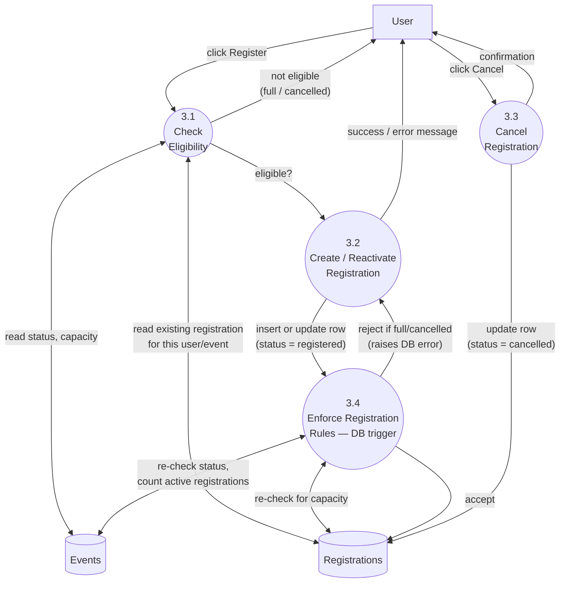

# 3.2.2 DFD Level 2 — Expansion of "3.0 Manage Registration"

This diagram expands process 3.0 from the Level 1 DFD into its sub-processes, showing how a registration request is validated both in the application and, as a second line of defense, by the database itself.

## Why validation happens twice

- **3.1 Check Eligibility** runs in the React app before showing the "Register" button as enabled, giving the user immediate feedback (e.g. a disabled "Event Full" button) without a round trip.
- **3.4 Enforce Registration Rules** is a PostgreSQL trigger (`enforce_registration_rules`, see [`supabase/migrations/001_initial_schema.sql`](../supabase/migrations/001_initial_schema.sql)) that re-checks the same conditions directly in the database on every insert/update to `registrations`. This closes the race condition where two users could both pass the client-side check for the last spot at the same time — only one of the two database writes will succeed once capacity is reached, and the trigger raises an error the UI displays to the losing request.
- Duplicate registrations are additionally prevented by a `unique (event_id, user_id)` constraint on the `registrations` table, which is why 3.2 is "Create **or Reactivate**": a user who previously cancelled and registers again updates their existing row rather than inserting a second one.
