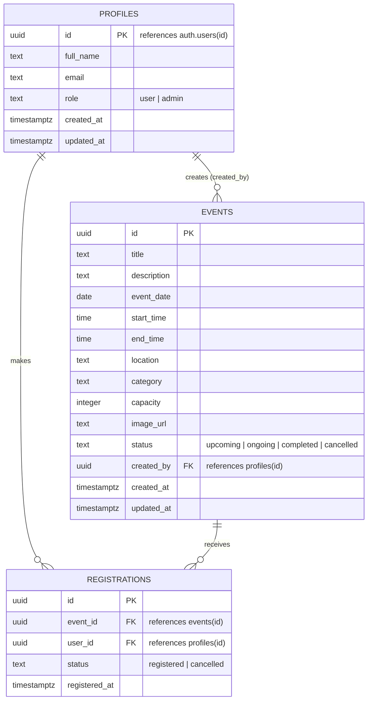

# 3.3 ER Diagram

## Notes

- `profiles.id` is both the primary key and a foreign key to Supabase's built-in `auth.users(id)` — there is a one-to-one relationship between an auth user and a profile, created automatically by the `handle_new_user` trigger the moment someone signs up.
- `registrations` has a **composite unique constraint** on `(event_id, user_id)` — not shown as a separate key in the diagram above, but enforced in the schema — which is what makes duplicate registrations for the same event impossible at the database level.
- `events.created_by` is nullable (`on delete set null`) so that deleting an admin's account does not delete the events they created.
- `registrations.event_id` and `registrations.user_id` both cascade on delete (`on delete cascade`): deleting an event or a user's auth account removes their associated registrations.
- Cancellation for both events and registrations is modeled as a **status change**, not a row deletion — this preserves history (e.g. an admin can see that a user registered and later cancelled) and is why there is no `DELETE` RLS policy on `registrations`.

Full column definitions, constraints, and the RLS policies referenced above are in [`09-database.md`](09-database.md) and the migration file [`supabase/migrations/001_initial_schema.sql`](../supabase/migrations/001_initial_schema.sql).
