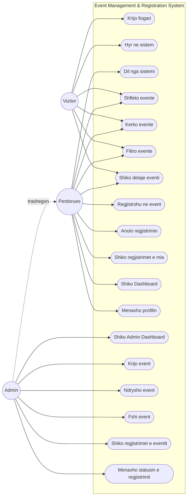
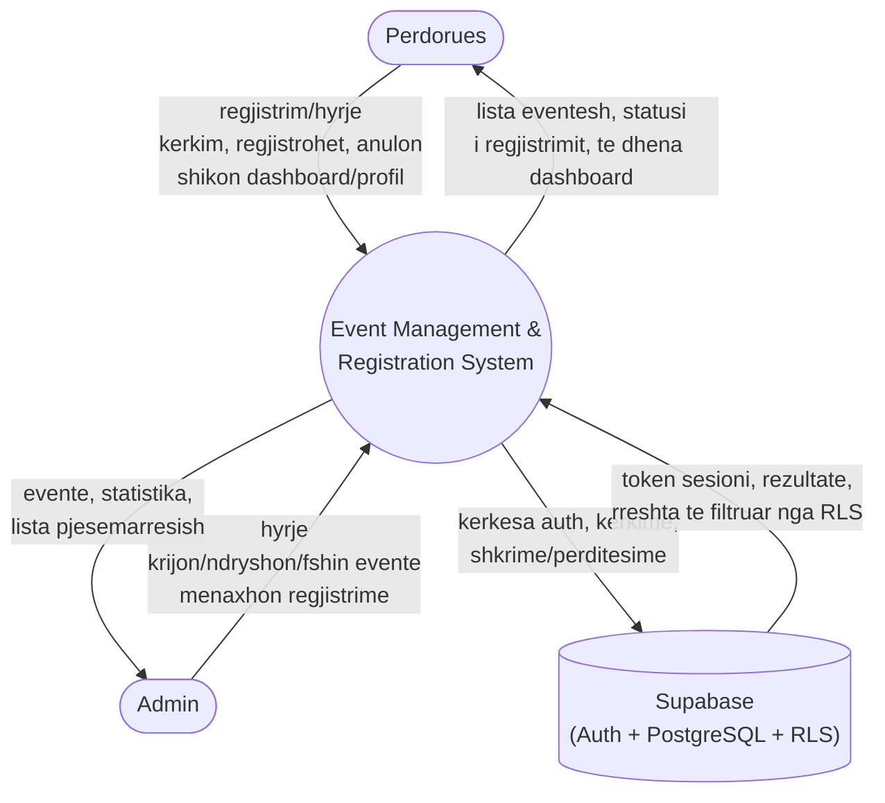
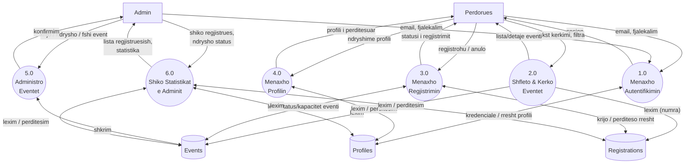
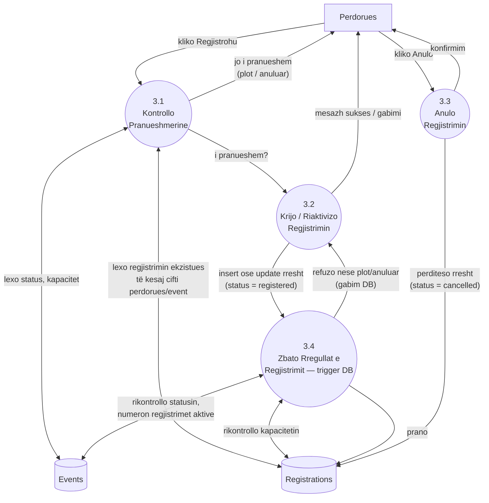
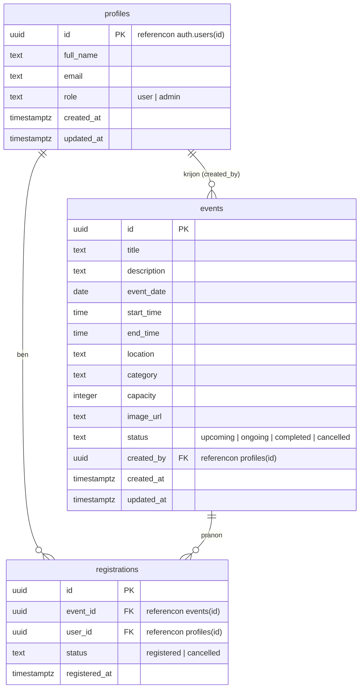

# FAQE 1 — KOPERTINA

**KOLEGJI AAB**
**LËNDA: Projekt II**

## Event Management & Registration System

**Punuar nga:** Ardit Selmani
**Profesori:** Ramadan Dervishi
**Data:** [PLOTËSO DATËN E DORËZIMIT]

*(Emrat e institucionit, lëndës, studentit dhe profesorit janë marrë nga skedarët e projektit (`docs/02-planning.md`); data e dorëzimit duhet plotësuar nga studenti.)*

---

# FAQJA 2 — PËRMBAJTJA

1.0 HYRJA
&nbsp;&nbsp;1.1 Qëllimi
&nbsp;&nbsp;1.2 Teknologjia
2.0 PLANIFIKIMI
&nbsp;&nbsp;2.1 Kohëzgjatja e projektit
&nbsp;&nbsp;2.2 Stafi i projektit
&nbsp;&nbsp;2.3 Use-Case: Përdorimi i programit
&nbsp;&nbsp;&nbsp;&nbsp;2.3.1 Use-Case Diagram
&nbsp;&nbsp;2.4 Context Diagram
&nbsp;&nbsp;2.5 DFD Level 1
&nbsp;&nbsp;2.6 DFD Level 2
&nbsp;&nbsp;2.7 ER Diagram
3.0 ANALIZA
&nbsp;&nbsp;3.1 Kërkesat funksionale
&nbsp;&nbsp;3.2 Kërkesat jo-funksionale
&nbsp;&nbsp;3.3 Aktorët
4.0 IMPLEMENTIMI
&nbsp;&nbsp;4.1 Autentifikimi
&nbsp;&nbsp;4.2 Roli i Përdoruesit
&nbsp;&nbsp;4.3 Roli i Adminit
&nbsp;&nbsp;4.4 Menaxhimi i Eventeve
&nbsp;&nbsp;4.5 Regjistrimi/Anulimi
&nbsp;&nbsp;4.6 Dashboard-et
&nbsp;&nbsp;4.7 Siguria (RLS)
&nbsp;&nbsp;4.8 Responsive Design
5.0 TESTIMI
6.0 PËRFUNDIMI DHE KUFIZIMET
7.0 FJALOR I TERMAVE

---

# 1.0 HYRJA

## 1.1 Qëllimi

**Event Management & Registration System** është një aplikacion web që mundëson menaxhimin e eventeve universitare dhe regjistrimin online të studentëve/stafit në to. Para një sistemi të tillë, organizimi i eventeve bazohej zakonisht në fletë-nënshkrimesh fizike, tabela të shpërndara me email, ose postime ad-hoc në rrjete sociale — praktika që nuk ofrojnë asnjë vend të vetëm autoritativ ku të shihen të gjitha eventet, asnjë mënyrë të besueshme për të ditur numrin e regjistruar apo nëse një event është plot, dhe asnjë ndjekje automatike të pjesëmarrësve.

Sistemi adreson këto probleme përmes dy roleve: **Përdoruesi (User)**, i cili shfleton, kërkon dhe filtron evente, regjistrohet ose anulon regjistrimin, dhe ndjek aktivitetin e vet nga një panel personal; dhe **Admini**, i cili krijon, ndryshon dhe fshin evente, dhe menaxhon listën e pjesëmarrësve për secilin event.

Rregullat e biznesit — një përdorues nuk mund të regjistrohet dy herë në të njëjtin event, nuk mund të regjistrohet në një event të anuluar, dhe nuk mund të regjistrohet kur eventi është plot — janë zbatuar jo vetëm në ndërfaqe, por edhe në vetë databazën, çka garanton korrektësinë e sistemit pavarësisht se si arrihet të dhëna (shih seksionin 4.7).

## 1.2 Teknologjia

Aplikacioni është **frontend i pastër (Single Page Application)**, i mbështetur tërësisht nga **Supabase** si Backend-as-a-Service. Nuk ekziston server i veçantë backend (p.sh. Node.js/Express).

| Shtresa | Teknologjia | Pse është zgjedhur |
|---|---|---|
| Build tool | **Vite** | Server zhvillimi i shpejtë, konfigurim minimal, standard aktual për projekte React. |
| Librari UI | **React 19** | Ndërtim me komponentë (component-based), teknologjia më e mësuar dhe standard në industri. |
| Ruting | **React Router v7** | Navigim në anën e klientit (client-side) për një SPA me rrugë të mbrojtura dhe rrugë vetëm-për-admin. |
| Stilizim | **CSS i thjeshtë** (variabla CSS, pa framework) | E mban projektin të lehtë për t'u shpjeguar dhe modifikuar drejtpërdrejt, pa varësi shtesë. |
| Backend/databazë | **Supabase (PostgreSQL)** | Databazë e menaxhuar me API REST të gjeneruar automatikisht — nuk nevojitet server i veçantë. |
| Autentifikim | **Supabase Auth** (email/fjalëkalim) | Menaxhon hash-imin e fjalëkalimeve, sesionet dhe token-et pa kod të shkruar manualisht. |
| Autorizim | **Row Level Security (RLS)** e PostgreSQL | Vendos direkt në databazë kush mund të lexojë/shkruajë cilat rreshta — jo vetëm në ndërfaqe. |
| Menaxhim gjendjeje | **React Context** (`AuthContext`) | I mjaftueshëm për shtrirjen e projektit; një librari si Redux do të ishte tepricë e panevojshme. |

Projekti nuk përdor shërbime me pagesë, servera të personalizuar, funksione AI, procesorë pagesash apo infrastrukturë mesazhesh. Kjo është një zgjedhje e qëllimshme për të mbajtur shtrirjen e projektit proporcionale me kërkesat e një projekti fakulteti.

---

# 2.0 PLANIFIKIMI

## 2.1 Kohëzgjatja e projektit

| Faza | Përshkrimi | Pesha e punës |
|---|---|---|
| 1. Kërkesat dhe planifikimi | Përcaktimi i shtrirjes, roleve, entiteteve | 10% |
| 2. Dizajni i databazës | Skema, kufizimet, politikat RLS, trigger-at | 15% |
| 3. Skeletoni i aplikacionit | Vite + React, ruting, konteksti i autentifikimit, komponentë të përbashkët | 15% |
| 4. Funksionalitetet kryesore | Shfaqja/kërkimi/filtrimi i eventeve, detajet e eventit, regjistrimi | 25% |
| 5. Funksionalitetet e Adminit | Paneli i adminit, CRUD i eventeve, menaxhimi i regjistrimeve | 20% |
| 6. Stilizimi dhe responsiviteti | CSS konsistent, layout mobil, gjendjet loading/empty/error | 5% |
| 7. Dokumentimi dhe diagramet | Dokumentacioni dhe diagramet Mermaid | 5% |
| 8. Testimi dhe korrigjimet | Kalim manual i testeve, korrigjim gabimesh | 5% |

*(Datat konkrete kalendarike duhen plotësuar nga studenti sipas afateve të lëndës.)*

## 2.2 Stafi i projektit

| Roli | Emri |
|---|---|
| Zhvilluesi | Ardit Selmani |
| Lënda | Projekt II |
| Profesori/Mentori | Ramadan Dervishi |
| Institucioni | Kolegji AAB |

## 2.3 Use-Case: Përdorimi i programit

Aktorët e sistemit janë tre: **Vizitor (Guest)** — vizitor i paautentifikuar; **Përdorues (User)** — llogari e autentifikuar me rol `user`, që trashëgon çdo aftësi të Vizitorit plus regjistrimin dhe menaxhimin e llogarisë; **Admin** — llogari e autentifikuar me rol `admin`, që trashëgon çdo aftësi të Përdoruesit plus menaxhimin e eventeve dhe regjistrimeve.

| ID | Use Case | Aktori | Përshkrimi |
|---|---|---|---|
| UC1 | Krijo llogari | Vizitor | Regjistrohet me emër, email, fjalëkalim. |
| UC2 | Hyr në sistem | Vizitor | Autentikohet me email dhe fjalëkalim. |
| UC3 | Dil nga sistemi | Përdorues | Përfundon sesionin aktual. |
| UC4 | Shfleto eventet | Vizitor, Përdorues | Shikon listën e të gjitha eventeve. |
| UC5 | Kërko evente | Vizitor, Përdorues | Filtron listën sipas titullit. |
| UC6 | Filtro evente | Vizitor, Përdorues | Filtron sipas kategorisë dhe/ose statusit. |
| UC7 | Shiko detajet e eventit | Vizitor, Përdorues | Hap faqen e plotë të një eventi. |
| UC8 | Regjistrohu në event | Përdorues | Krijon (ose riaktivizon) një regjistrim, sipas rregullave të kapacitetit/statusit. |
| UC9 | Anulo regjistrimin | Përdorues | Ndryshon statusin e regjistrimit në "cancelled". |
| UC10 | Shiko regjistrimet e mia | Përdorues | Sheh të gjitha regjistrimet e veta, aktive dhe të anuluara. |
| UC11 | Shiko Dashboard-in | Përdorues | Sheh përmbledhje: evente të ardhshme, numra regjistrimesh, aktivitet i fundit. |
| UC12 | Menaxho profilin | Përdorues | Sheh dhe përditëson emrin e plotë. |
| UC13 | Shiko Admin Dashboard-in | Admin | Sheh statistika mbarë-sistemi. |
| UC14 | Krijo event | Admin | Shton një event të ri. |
| UC15 | Ndrysho event | Admin | Modifikon detajet e një eventi ekzistues. |
| UC16 | Fshi event | Admin | Heq një event (me konfirmim), duke fshirë në zinxhir edhe regjistrimet e tij. |
| UC17 | Shiko regjistrimet e eventit | Admin | Sheh të gjithë të regjistruarit për një event specifik. |
| UC18 | Menaxho statusin e regjistrimit | Admin | Anulon ose rikthen regjistrimin e një pjesëmarrësi. |

### 2.3.1 Use-Case Diagram

Ndërveprimi më i rëndësishëm në sistem është **Regjistrimi në event (UC8)**: përdoruesi hap detajet e eventit; nëse nuk është i kyçur, kërkohet të kyçet; nëse eventi është i anuluar, i përfunduar ose plot, regjistrimi bllokohet me mesazh të qartë; përndryshe krijohet (ose riaktivizohet) rreshti i regjistrimit, ndërsa databaza rikontrollon në mënyrë të pavarur kapacitetin dhe statusin në momentin e shkrimit (shih seksionin 2.6).

## 2.4 Context Diagram

**Përdoruesi** dhe **Admini** janë entitetet e jashtme njerëzore; ndërveprojnë vetëm përmes aplikacionit React në shfletues. **Supabase** është sistemi i vetëm i jashtëm: ofron autentifikim (lëshim/vlerësim token-esh sesioni), databazën PostgreSQL, dhe RLS (vendos, për çdo kërkesë, cilat rreshta lejohet t'i lexojë/shkruajë përdoruesi i autentifikuar). Procesi **Event Management & Registration System** përfaqëson tërë aplikacionin React — nuk ka qëllimisht një proces të veçantë backend, sepse API-ja e auto-gjeneruar e Supabase-it plus RLS luajnë atë rol.

## 2.5 DFD Level 1

| Procesi | Përshkrimi | Lexon | Shkruan |
|---|---|---|---|
| 1.0 Menaxho Autentifikimin | Regjistrim, hyrje, dalje, rikthim sesioni | Profiles (roli) | Profiles (krijohet automatikisht via trigger) |
| 2.0 Shfleto & Kërko Eventet | Listim, kërkim, filtrim, detaje | Events, Registrations (numra) | — |
| 3.0 Menaxho Regjistrimin | Regjistrohu/anulo | Events, Registrations | Registrations |
| 4.0 Menaxho Profilin | Shiko/përditëso emrin | Profiles | Profiles |
| 5.0 Administro Eventet | Krijo/ndrysho/fshi | Events | Events |
| 6.0 Shiko Statistikat | Numra dashboard, menaxhim regjistrues | Profiles, Events, Registrations | Registrations (ndryshim statusi) |

## 2.6 DFD Level 2 — Zgjerimi i "3.0 Menaxho Regjistrimin"

Validimi ndodh **dy herë, në mënyrë të qëllimshme**: **3.1** ekzekutohet në React përpara se butoni "Regjistrohu" të shfaqet aktiv, duke dhënë përgjigje të menjëhershme (p.sh. buton "Event Full" i çaktivizuar) pa pritur përgjigje nga serveri. **3.4** është një trigger i PostgreSQL (`enforce_registration_rules`) që rikontrollon të njëjtat kushte direkt në databazë, në çdo insert/update mbi `registrations`. Kjo mbyll "race condition"-in ku dy përdorues mund të kalojnë njëkohësisht kontrollin në ndërfaqe për vendin e fundit të lirë — vetëm njëri prej dy shkrimeve në databazë do të pranohet pasi kapaciteti mbushet, dhe trigger-i ngre një gabim që ndërfaqja e shfaq te kërkesa humbëse. Regjistrimet e dyfishta parandalohen shtesë nga një kufizim `unique (event_id, user_id)` mbi tabelën `registrations`, prandaj 3.2 quhet "Krijo **ose Riaktivizo**": një përdorues që më parë ka anuluar dhe regjistrohet përsëri përditëson rreshtin ekzistues, në vend që të krijojë një të dytë.

## 2.7 ER Diagram

`profiles.id` është njëkohësisht çelës primar dhe çelës i huaj drejt `auth.users(id)` të Supabase-it — ekziston një relacion një-me-një mes një përdoruesi të autentifikuar dhe profilit të tij, krijuar automatikisht nga trigger-i `handle_new_user` në momentin e regjistrimit. Tabela `registrations` ka një **kufizim unik të kombinuar** mbi `(event_id, user_id)`, i cili e bën të pamundur regjistrimin e dyfishtë në nivel databaze. `events.created_by` lejon vlerë `null` (`on delete set null`), kështu që fshirja e llogarisë së një admini nuk fshin eventet e krijuara prej tij. Anulimi, si për evente ashtu edhe për regjistrime, modelohet si **ndryshim statusi**, jo si fshirje rreshti — kjo ruan historikun (p.sh. admini sheh që përdoruesi u regjistrua e më pas anuloi).

---

# 3.0 ANALIZA

## 3.1 Kërkesat funksionale

**Vizitor/Përdorues:**

| ID | Kërkesa |
|---|---|
| FR1 | Vizitori mund të krijojë llogari me email dhe fjalëkalim. |
| FR2 | Përdoruesi mund të hyjë dhe dalë nga sistemi. |
| FR3 | Sesioni i përdoruesit ruhet edhe pas rifreskimit të faqes. |
| FR4 | Vizitori/Përdoruesi mund të shfletojë të gjitha eventet. |
| FR5 | Vizitori/Përdoruesi mund të kërkojë evente sipas titullit. |
| FR6 | Vizitori/Përdoruesi mund të filtrojë evente sipas kategorisë dhe statusit. |
| FR7 | Vizitori/Përdoruesi mund të hapë faqen e detajeve të një eventi. |
| FR8 | Përdoruesi mund të regjistrohet në një event, nëse ai nuk është i anuluar, i përfunduar, ose plot. |
| FR9 | Përdoruesi nuk mund të regjistrohet dy herë në të njëjtin event. |
| FR10 | Përdoruesi mund të anulojë regjistrimin e vet. |
| FR11 | Përdoruesi mund të shohë të gjitha regjistrimet e veta (aktive dhe të anuluara). |
| FR12 | Përdoruesi mund të shohë një dashboard përmbledhës të aktivitetit të vet. |
| FR13 | Përdoruesi mund të shohë dhe përditësojë emrin e vet të plotë. |

**Admin:**

| ID | Kërkesa |
|---|---|
| FR14 | Admini mund të shohë një dashboard me statistika bazë (evente gjithsej, evente të ardhshme, regjistrime aktive, përdorues gjithsej). |
| FR15 | Admini mund të krijojë një event të ri. |
| FR16 | Admini mund të ndryshojë një event ekzistues. |
| FR17 | Admini mund të fshijë një event (me konfirmim). |
| FR18 | Admini mund të shohë të gjitha eventet, pavarësisht statusit. |
| FR19 | Admini mund të shohë listën e pjesëmarrësve për një event të caktuar. |
| FR20 | Admini mund të ndryshojë statusin e një regjistrimi (anulim ose rikthim në emër të pjesëmarrësit). |

## 3.2 Kërkesat jo-funksionale

| ID | Kërkesa |
|---|---|
| NFR1 (Siguria) | Autorizimi duhet zbatuar në nivel databaze (RLS), jo vetëm i fshehur në ndërfaqe. |
| NFR2 (Përdorshmëria) | Ndërfaqja duhet të kuptohet pa trajnim — etiketa të qarta, gjendje loading/empty/error të dukshme, konfirmim para veprimeve destruktive. |
| NFR3 (Responsiviteti) | Layout-i duhet të funksionojë pa "overflow" horizontal, si në desktop ashtu edhe në mobil. |
| NFR4 (Integriteti i të dhënave) | Regjistrimet e dyfishta, regjistrimet në evente të anuluara, dhe regjistrimet përtej kapacitetit duhet të jenë të pamundura, të zbatuara nga kufizime/trigger-a të databazës si linjë e dytë mbrojtjeje pas ndërfaqes. |
| NFR5 (Mirëmbajtshmëria) | Kodi duhet të përdorë strukturë të qartë e konvencionale React (components/pages/context/lib). |
| NFR6 (Kostoja) | Sistemi duhet të funksionojë tërësisht mbi shërbime falas (Supabase free tier), pa API me pagesë. |

## 3.3 Aktorët

| Aktori | Përshkrimi |
|---|---|
| **Vizitor (i paautentifikuar)** | Sheh landing page-in dhe shfleton/kërkon evente, por nuk mund të regjistrohet. |
| **Përdorues** | Llogari e autentifikuar, rol `user`. Shfleton evente, regjistrohet/anulon, menaxhon profilin e vet. |
| **Admin** | Llogari e autentifikuar, rol `admin`. Ka gjithçka që ka Përdoruesi, plus menaxhim të plotë të eventeve dhe mbikëqyrje të regjistrimeve. |
| **Supabase (sistem)** | Platforma backend që ofron autentifikim, ruajtje në databazë, dhe kontroll aksesi (RLS). Nuk është aktor njerëzor, por shfaqet në Context Diagram si sistem i jashtëm. |

Kompleksiteti kryesor i sistemit nuk qëndron te ndërfaqja, por te **saktësia e autorizimit**: një Përdorues dhe një Admin shohin kryesisht të njëjtat faqe, por çfarë u lejohet të *bëjnë* ndryshon, dhe kjo dallim duhet të mbahet edhe nëse dikush anashkalon ndërfaqen dhe thërret API-në e Supabase-it direkt. Kjo është arsyeja pse faza e Analizës dhe Dizajnit u përqendrua te skema e databazës dhe politikat RLS përpara se të fillonte puna me ndërfaqen (shih seksionet 2.7 dhe 4.7).

---

# 4.0 IMPLEMENTIMI

## 4.1 Autentifikimi

Autentifikimi menaxhohet nga një kontekst i vetëm React, `AuthContext` (`src/context/AuthContext.jsx`). Në momentin e ngarkimit të aplikacionit, ky kontekst thërret `supabase.auth.getSession()` për të rikthyer një sesion ekzistues nga ruajtja lokale e shfletuesit, e më pas ngarkon rreshtin përkatës nga tabela `profiles` (që përmban rolin `user`/`admin`). Konteksti abonohet gjithashtu te `supabase.auth.onAuthStateChange`, kështu që hyrja/dalja në një skedë (tab) përditëson menjëherë gjendjen në të gjithë aplikacionin.

`AuthContext` ekspozon funksionet `signUp`, `signIn`, `signOut`, si dhe vlerat `user`, `profile`, `isAdmin` (bazuar te fusha `role`), dhe `loading`. Ruajtja e sesionit, rifreskimi i token-ave, dhe hash-imi i fjalëkalimeve trajtohen tërësisht nga Supabase Auth — nuk është shkruar kod i personalizuar për to. Faqet `Login.jsx` dhe `Signup.jsx` përdorin këto funksione dhe shfaqin mesazhe të qarta gabimi (p.sh. "Incorrect email or password", "An account with this email already exists").

## 4.2 Roli i Përdoruesit

Një llogari me rol `user` ka akses te faqet: `/events` (shfletim/kërkim/filtrim), `/events/:id` (detaje + regjistrim), `/dashboard` (përmbledhje personale), `/my-registrations` (të gjitha regjistrimet, aktive dhe të anuluara, me tab-e), dhe `/profile` (ndryshim i emrit të plotë). Këto faqe mbrohen nga komponenti `ProtectedRoute` (`src/components/ProtectedRoute.jsx`), i cili ridrejton te `/login` nëse nuk ka sesion aktiv, duke ruajtur faqen e synuar fillimisht (`state={{ from: location }}`) për ta rikthyer përdoruesin atje pas hyrjes.

## 4.3 Roli i Adminit

Një llogari me rol `admin` ka akses shtesë te `/admin` (dashboard me statistika), `/admin/events` (listë + fshirje), `/admin/events/new` dhe `/admin/events/:id/edit` (formë e përbashkët `EventForm`), dhe `/admin/events/:id/registrations` (listë pjesëmarrësish me mundësi ndryshimi statusi). Këto rrugë mbrohen nga `AdminRoute` (`src/components/AdminRoute.jsx`), që ridrejton te `/login` nëse s'ka sesion, ose te `/dashboard` nëse përdoruesi është i kyçur por jo admin. Sikurse theksohet në `10-implementation.md`, këto mbrojtje kontrollojnë vetëm çfarë shfaqet në shfletues — kufiri real i sigurisë janë politikat RLS të databazës (seksioni 4.7), të cilat mbeten aktive edhe nëse dikush thërret API-në direkt, duke anashkaluar ndërfaqen.

Promovimi i llogarisë së parë në admin bëhet manualisht nga SQL Editor-i i Supabase-it (`update public.profiles set role = 'admin' where email = '...'`), sepse projekti nuk përfshin një ndërfaqe vetë-promovimi — një zgjedhje e qëllimshme sigurie.

## 4.4 Menaxhimi i Eventeve

Krijimi dhe ndryshimi i eventeve përdorin të njëjtin komponent, `EventForm` (`src/components/EventForm.jsx`), me fusha: titull, përshkrim, datë, orë fillimi/mbarimi, vendndodhje, kategori, kapacitet, URL imazhi (opsionale), dhe status. Validimi kryhet në anën e klientit përpara dërgimit: fushat e detyrueshme nuk mund të jenë bosh, ora e mbarimit duhet të jetë pas orës së fillimit, dhe kapaciteti duhet të jetë numër i plotë më i madh se zero.

`AdminEventForm.jsx` përdor këtë formë si për krijim (`supabase.from('events').insert(...)`, me `created_by` të vendosur te ID e adminit aktual) ashtu edhe për ndryshim (`supabase.from('events').update(...).eq('id', id)`). Fshirja e eventeve (`AdminEvents.jsx`) kërkon konfirmim përmes një dritareje modale (`Modal.jsx`) përpara se të kryhet `supabase.from('events').delete()`; fshirja e një eventi fshin automatikisht (në zinxhir, `on delete cascade`) edhe regjistrimet e tij, siç përcaktohet në skemën e databazës.

## 4.5 Regjistrimi/Anulimi

Logjika e regjistrimit është e përqendruar te komponenti `RegistrationButton` (`src/components/RegistrationButton.jsx`), i cili shfaq gjendjen e duhur në varësi të rrethanave: nëse vizitori nuk është i kyçur, shfaqet lidhje për të hyrë; nëse është tashmë i regjistruar, shfaqet butoni "Cancel Registration"; nëse eventi është i anuluar ose i përfunduar, shfaqet mesazh që bllokon regjistrimin; nëse eventi është plot, butoni "Event Full" është i çaktivizuar; përndryshe shfaqet butoni aktiv "Register for this event".

Regjistrimi kryen `insert` (ose `update`, nëse ekziston tashmë një rresht i anuluar) mbi tabelën `registrations` me `status: 'registered'`. Anulimi (nga `RegistrationButton`, `MyRegistrations.jsx`, ose nga admini te `AdminEventRegistrations.jsx`) ndryshon vetëm fushën `status` në `'cancelled'` — nuk fshihet asnjë rresht, çka ruan historikun. Siç u shpjegua në seksionin 2.6, çdo shkrim mbi `registrations` rikontrollohet edhe nga trigger-i `enforce_registration_rules` në databazë, si mbrojtje e dytë kundër kushteve gare (race conditions) dhe manipulimit direkt të API-së.

## 4.6 Dashboard-et

`Dashboard.jsx` (për përdoruesin) merr të gjitha regjistrimet e llogarisë aktuale (`supabase.from('registrations').select('id, status, registered_at, events(*)').eq('user_id', user.id)`), duke shfrytëzuar aftësinë e Supabase-it për të bashkuar (join) automatikisht të dhënat e tabelës `events` përmes çelësit të huaj. Prej tyre llogariten tri statistika (regjistrime aktive, evente të ardhshme, regjistrime gjithsej), lista e "eventeve të ardhshme" (të renditura sipas datës), dhe "aktiviteti i fundit" (5 regjistrimet më të fundit).

`AdminDashboard.jsx` llogarit katër statistika mbarë-sistemi duke përdorur `count: 'exact', head: true` në katër kërkesa paralele (`Promise.all`) mbi `events` dhe `profiles`, pa shkarkuar të dhëna të panevojshme. `AdminEventRegistrations.jsx` shfaq listën e pjesëmarrësve për një event specifik, duke bashkuar `registrations` me `profiles(full_name, email)`, dhe lejon admin-in të ndërrojë statusin e secilit pjesëmarrës me një klikim.

## 4.7 Siguria (RLS)

Siguria e sistemit mbështetet mbi tre shtylla, të gjitha të zbatuara direkt në PostgreSQL, jo vetëm në kod aplikacioni: **Row Level Security (RLS)**, **trigger-a validimi**, dhe **funksione ndihmëse `security definer`**.

RLS është aktivizuar mbi të tri tabelat. Politikat kryesore:

| Tabela | Veprimi | Kush lejohet | Logjika e politikës |
|---|---|---|---|
| `profiles` | SELECT | Pronari ose admini | `auth.uid() = id OR is_admin()` |
| `profiles` | UPDATE | Vetëm pronari | `auth.uid() = id` |
| `profiles` | INSERT/DELETE | Askush (asnjë politikë) | Rreshtat krijohen vetëm nga trigger-i `handle_new_user`. |
| `events` | SELECT | Kushdo (edhe anonim) | `true` |
| `events` | INSERT/UPDATE/DELETE | Vetëm admini | `is_admin()` |
| `registrations` | SELECT | Pronari ose admini | `auth.uid() = user_id OR is_admin()` |
| `registrations` | INSERT | Vetëm për vete | `auth.uid() = user_id` |
| `registrations` | UPDATE | Pronari ose admini | `auth.uid() = user_id OR is_admin()` |
| `registrations` | DELETE | Askush (asnjë politikë) | Anulimi modelohet si ndryshim statusi, jo fshirje. |

Funksioni `is_admin()` (`security definer`) kontrollon rolin e përdoruesit aktual pa shkaktuar rekursion me politikën RLS të vetë tabelës `profiles`. Trigger-i `prevent_role_escalation` parandalon që një përdorues jo-admin të ndryshojë vetë fushën `role` të profilit të vet — një kontroll shtesë përtej RLS-së, sepse RLS nuk mund të kufizojë kolona individuale brenda një `UPDATE`. Trigger-i `enforce_registration_rules` refuzon çdo shkrim mbi `registrations` që shkel rregullat e kapacitetit ose statusit të eventit (shih seksionin 2.6).

Sepse këto rregulla jetojnë në vetë PostgreSQL-in, ato mbeten në fuqi edhe nëse dikush anashkalon plotësisht aplikacionin React dhe thërret API-në REST të Supabase-it direkt me token-in e vet — pikë e verifikuar konkretisht gjatë testimit (seksioni 5.0). Në anën e klientit përdoret vetëm çelësi publik **anon**; çelësi `service_role`, që anashkalon RLS-në, nuk përdoret asnjëherë në kod (shih `.env.example`).

## 4.8 Responsive Design

Stilizimi bazohet në CSS të thjeshtë, me variabla të përcaktuara një herë në `src/index.css` (ngjyra, hapësira) dhe klasa të përbashkëta (`.btn`, `.card`, `.badge`, `.form-group`, `.events-grid`) të ripërdorura në të gjitha faqet. Navbar-i (`src/components/Navbar.jsx`) shndërrohet në meny të palosshme (hamburger) në gjerësi të ngushta ekrani, e kontrolluar nga një gjendje lokale `menuOpen`. Layout-i është testuar konkretisht në dy gjerësi ekrani, 1280px (desktop) dhe 375px (mobil), pa "overflow" horizontal në asnjë faqe (shih seksionin 5.0, Kalimi 2).

---

# 5.0 TESTIMI

Testimi u krye në tri kalime, të gjitha ekzekutuar realisht (asnjë rezultat i mëposhtëm nuk është supozuar):

**Kalimi 1 — Build & Lint:** `vite build` (ndërtimi për prodhim) kaloi pa gabime; `oxlint` raportoi 0 gabime dhe 1 paralajmërim informativ (pattern-i standard i React Fast Refresh në `AuthContext.jsx`, jo defekt).

**Kalimi 2 — Ndërfaqe/Layout:** faqet Landing, Events, Login, Signup u testuan në 1280px dhe 375px — pa "overflow" horizontal, menyja mobile hapet/mbyllet saktë, pa gabime të papritura në konsolë.

**Kalimi 3 — Rrjedha e të dhënave (Supabase real):** u testua mbi një projekt real Supabase, të mbjellë me `supabase/seed.sql`, duke përdorur dy llogari reale (student dhe admin). U verifikuan: regjistrimi dhe hyrja (me mesazhe gabimi të sakta për kredenciale të gabuara), ruajtja e sesionit pas rifreskimit, mbrojtja e rrugëve (`/dashboard`, `/admin`) si në ndërfaqe ashtu edhe në databazë, shfletimi/kërkimi/filtrimi i eventeve, regjistrimi dhe anulimi (përfshirë parandalimin e regjistrimit të dyfishtë dhe riaktivizimin pas anulimit), dashboard-et e të dyja roleve, dhe operacionet CRUD të plota të adminit mbi evente e regjistrime.

U kryen gjithashtu **teste direkte kundër RLS-së**, duke thirrur API-në e Supabase-it jashtë ndërfaqes: një përdorues jo-admin nuk arriti të krijojë/ndryshojë/fshijë evente, nuk arriti të regjistrohej në emër të dikujt tjetër, nuk arriti të lexonte regjistrimet apo profilin e dikujt tjetër, dhe nuk arriti të vetë-promovohej në admin — të gjitha u refuzuan nga databaza, siç pritej.

**Një defekt real u gjet dhe u korrigjua gjatë testimit:** trigger-i `prevent_role_escalation` kontrollonte `is_admin()` pa kushtëzim, duke përfshirë rastin kur SQL Editor-i (që vepron si pronar i databazës, pa `auth.uid()`) përdorej për të promovuar admin-in e parë — në atë rast `is_admin()` kthente `false` dhe trigger-i e rikthente rolin te `'user'`, duke bllokuar promovimin e dokumentuar. U korrigjua duke shtuar kushtin `auth.uid() is not null`, në mënyrë që mbrojtja të zbatohet vetëm për kërkesa të bëra përmes një sesioni të autentifikuar, jo për administrim direkt të databazës.

---

# 6.0 PËRFUNDIMI DHE KUFIZIMET

Event Management & Registration System është një aplikacion React i pastër (frontend-only), i mbështetur nga Supabase (PostgreSQL, Auth, dhe Row Level Security), që u lejon studentëve të shfletojnë dhe regjistrohen në evente universitare, dhe adminëve t'i menaxhojnë ato dhe pjesëmarrësit e tyre. Projekti u mbajt qëllimisht brenda një shtrirjeje të përshtatshme për një projekt fakulteti: dy role, tri tabela databaze, dhe një grup i fokusuar funksionalitetesh — pa pagesa, pa infrastrukturë mesazhesh, pa AI, pa server të personalizuar.

Arritja kryesore teknike është se **autorizimi zbatohet dy herë, në mënyrë të pavarur**: një herë në ndërfaqe (për përgjigje të menjëhershme dhe përvojë të pastër përdoruesi), dhe një herë në databazë përmes RLS dhe trigger-ave (për siguri reale). Kjo garanton që sistemi mbetet korrekt edhe kundër aksesit direkt në API që anashkalon plotësisht aplikacionin React — veti e demonstruar konkretisht gjatë testimit (seksioni 5.0).

**Kufizimet e njohura:** nuk ekziston rrjedhë rikthimi fjalëkalimi me email; nuk ekziston vetë-promovim admini (bëhet vetëm via SQL); nuk ekziston suitë testesh e automatizuar (testimi ishte manual, sipas shtrirjes së projektit).

**Shtrirje të mundshme (jo të implementuara):** njoftime me email pas regjistrimit/anulimit (kërkojnë Supabase Edge Functions + një ofrues emaili); lista pritjeje (waitlist) për evente plot; suitë testesh e automatizuar (unit/integration); kategoritë e eventeve si tabelë e veçantë në vend të tekstit të lirë, nëse do të kërkohej qeverisje më e rreptë e të dhënave. Këto u lanë qëllimisht jashtë shtrirjes për ta mbajtur projektin proporcional me një detyrë fakulteti.

---

# 7.0 FJALOR I TERMAVE

| Termi | Shpjegimi |
|---|---|
| **SPA (Single Page Application)** | Aplikacion web që ngarkon një faqe të vetme HTML dhe ndryshon përmbajtjen dinamikisht me JavaScript, pa rifreskim të plotë të faqes. |
| **BaaS (Backend-as-a-Service)** | Shërbim që ofron funksione backend (databazë, autentifikim, API) gati për përdorim, pa nevojën për të ndërtuar server nga zero. Supabase është shembulli i përdorur këtu. |
| **React** | Librari JavaScript për ndërtimin e ndërfaqeve përmes komponentësh të ripërdorshëm. |
| **Component (Komponent)** | Njësi e pavarur ndërfaqeje (p.sh. `EventCard`, `Navbar`) që merr të dhëna (props) dhe kthen HTML. |
| **Props** | Të dhëna që një komponent prind ia kalon një komponenti bir, të palexueshme nga vetë biri. |
| **State (Gjendje)** | Të dhëna të brendshme të një komponenti, që kur ndryshojnë shkaktojnë rirenderim të ndërfaqes (p.sh. `useState`). |
| **Hook** | Funksion special i React (fillon me `use`, p.sh. `useState`, `useEffect`) që lejon përdorimin e gjendjes dhe efekteve anësore në komponentë funksionalë. |
| **Context (Kontekst)** | Mekanizëm i React për të ndarë të dhëna (p.sh. `AuthContext`) mes komponentësh pa i kaluar manualisht si props në çdo nivel. |
| **Vite** | Mjet ndërtimi (build tool) që ofron server zhvillimi të shpejtë dhe paketim për prodhim. |
| **React Router** | Librari për navigim (ruting) në anën e klientit brenda një SPA. |
| **PostgreSQL** | Sistem databaze relacionale me burim të hapur, mbi të cilin ndërtohet Supabase. |
| **RLS (Row Level Security)** | Mekanizëm i PostgreSQL që kufizon, rresht për rresht, cilat të dhëna mund t'i lexojë/shkruajë një përdorues i caktuar. |
| **Trigger** | Funksion në databazë që ekzekutohet automatikisht kur ndodh një ngjarje (insert/update/delete) mbi një tabelë. |
| **JWT (JSON Web Token)** | Token i koduar që identifikon një sesion të autentifikuar; përdoret nga Supabase Auth për të vërtetuar kush është përdoruesi në çdo kërkesë. |
| **Primary Key (Çelës primar)** | Kolonë (ose kolona) që identifikon në mënyrë unike çdo rresht të një tabele. |
| **Foreign Key (Çelës i huaj)** | Kolonë që referencon çelësin primar të një tabele tjetër, duke krijuar relacion mes tyre. |
| **UUID** | Identifikues unik universal (string 128-bit), përdorur këtu si çelës primar në vend të numrave rritës. |
| **CRUD** | Create, Read, Update, Delete — katër operacionet bazë mbi të dhëna. |
| **API REST** | Ndërfaqe që lejon komunikim mes klientit dhe serverit përmes kërkesave HTTP standarde; në Supabase gjenerohet automatikisht nga skema e databazës. |
| **Async/Await** | Sintaksë JavaScript për të shkruar kod asinkron (që pret përgjigje, p.sh. nga databaza) në formë të lexueshme, sekuenciale. |
| **Environment Variable (Variabël mjedisi)** | Vlerë konfigurimi (p.sh. `VITE_SUPABASE_URL`) e ruajtur jashtë kodit burimor, tipikisht në një skedar `.env`, për të mos ekspozuar çelësa apo adresa direkt në kod. |
